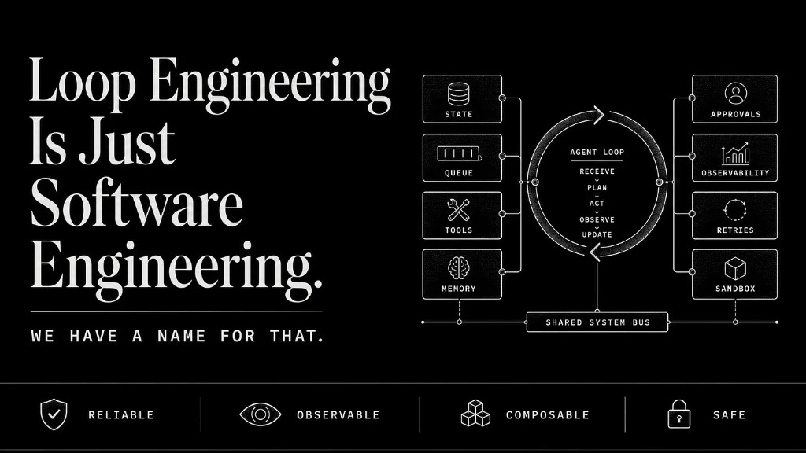
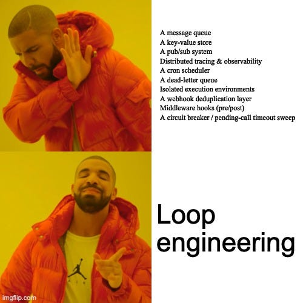
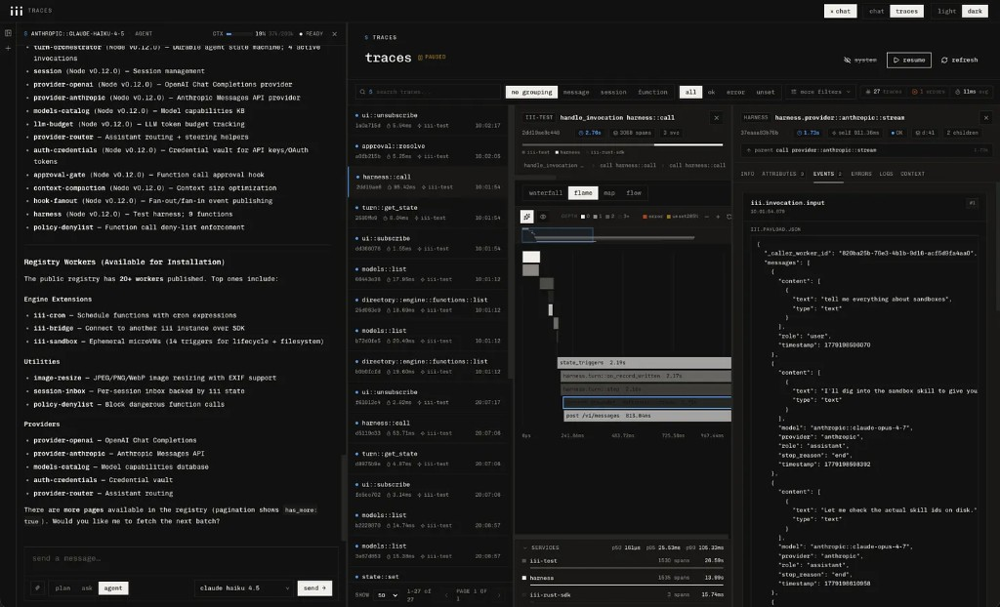
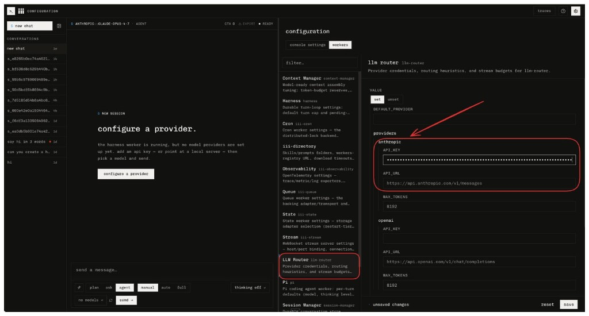
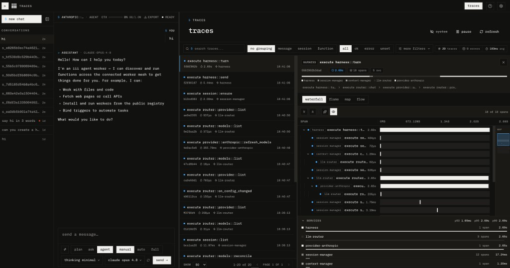

A few weeks ago [Addy Osmani](https://x.com/addyosmani), formerly of Google
Chrome, now author of *Beyond Vibe Coding*, published a piece called *Loop
Engineering*. It opened with a quote from [Peter Steinberger](https://x.com/steipete):
"You shouldn't be prompting coding agents anymore. You should be designing loops
that prompt your agents." [Boris Cherny](https://x.com/bcherny), head of Claude
Code at Anthropic, said the same thing: "I don't prompt Claude anymore. I have loops running that prompt
Claude and figuring out what to do. My job is to write loops."

LangChain followed with *The Art of Loop Engineering*, laying out a four-level
architecture. Tooling appeared: LoopFlow on GitHub, Neuralyzer for self-wiping
agent context windows. The term now has 987 results on the Hacker News search
API.

It is also a good description of a distributed system. We have been building
those for twenty years.



## What Loop Engineering Actually Describes

Per Addy Osmani and LangChain's own writing, a production loop has four levels:

- **The agent loop:** a model calling tools repeatedly until a task completes.
- **A verification loop:** a grader checks output against a rubric and retries on failure.
- **An event-driven loop:** cron schedules or webhooks trigger agent runs automatically.
- **A hill-climbing loop:** production traces feed an analysis agent that rewrites the harness configuration.

Surrounding everything: memory -- "a markdown file, or a Linear board, anything
that lives outside the single conversation and holds what's done and what is
next." Addy's words, not mine.

This is a complete description of an event-driven, observable, stateful
distributed system with retry logic, dead-letter handling, pub/sub fan-out, and
durable external state.

Let me translate the terminology:

| Loop Engineering Primitive | What It Actually Is |
| --- | --- |
| "Automations that run on a schedule" | Cron trigger |
| "Memory that lives outside the conversation" | Key-value store |
| "Sub-agents that don't step on each other" | Isolated workers consuming from a message queue |
| "Verifier checks the maker's work" | Pub/sub consumer with retry logic |
| "Traces feed the hill-climbing loop" | Observability pipeline |
| "Dead work lands in a triage inbox" | Dead-letter queue |
| "Loop runs until a condition is true" | Queue-backed durable execution with completion condition |
| "Plugins connect your tools" | Webhook integrations |

The naming is different. The systems are the same.

A developer on Hacker News built a loop engineering pipeline for
Korean-to-English translation before the term existed -- a plan, execute,
critique, repair loop with a separate reference translator as an "impartial
witness," a translation memory to prevent terminology drift, and an output
writer appending incrementally to disk. Textbook loop engineering architecture.

Their conclusion: "the critic kept flagging that the translation is not good
enough and looping back and the translator was not able to translate good enough
for the critic to be satisfied... after a couple of weeks I kind of gave up."

An unobservable retry loop with no circuit breaker, no dead-letter queue, no
backpressure, and no durable state is loop engineering on paper. In production
it just runs until something breaks.

## iii's Harness Worker

iii ships a worker called `harness`. Its own description is "thin durable turn
loop that wires session-manager, context-manager, and llm-router into an agent
loop; spawns sub-agents as child sessions." That is loop engineering, in one
command: `iii worker add harness`.

Now look at its dependencies. `iii-state` for a key-value store. `iii-queue` for
a message queue. `iii-cron` for the scheduler. `iii-observability` for
distributed tracing. `iii-stream` for streaming output. `session-manager` for
transcript persistence. `context-manager` for token budgeting. Every loop
engineering primitive -- the memory, the durable execution, the scheduling, the
observability, the streaming -- is a named, separately installable worker that
the harness composes. In the dependency manifest. The harness does not abstract
over those things. It *is* those things, composed.



The harness's core function, `harness::turn`, is described in the registry as an
internal durable loop step enqueued onto the default queue, not called directly.
The agent loop step itself is a message queue consumer. Every iteration of the
model's think-act cycle is a job enqueued onto `iii-queue` and drained by a
worker. If the process crashes mid-turn, the queue holds the step and another
worker picks it up where it left off. This is durable execution. SQS launched in
2006.

`harness::sweep-pending` is described as: "Internal cron sweep: resolve pending
function calls past their timeout so a parked turn never wedges." The mechanism
that stops loop engineering from running forever and eating all your tokens is a
cron job. Configurable via `sweep_expression: "0 * * * * *"` in `config.yaml`. It
scans all turn records, finds any pending function calls that have exceeded their
timeout, resolves them, and unparks the stalled turn.

In loop engineering vocabulary this is called "your verification loop has a
stopping condition." In software engineering vocabulary it's called a circuit
breaker backed by a scheduled job. The implementation is identical.

`harness::spawn` -- "Spawn a sub-agent in a child session; the model-facing
pending trigger" -- creates a child session with its own turn budget, its own
function policy (which can only narrow, never escalate beyond the parent's
permissions), and its own `max_children` fan-out guard.

This is exactly what loop engineering calls "sub-agents so the maker and checker
don't share context." The harness implements it as isolated session trees with
scoped permission inheritance, all running as separate queue-backed turn loops.
"Two agents that don't step on each other" is two workers consuming from separate
queue sessions.

The harness exposes five synchronous hook points:

- `harness::hook::pre-turn` -- fires before any model spend; can veto the turn
- `harness::hook::pre-generate` -- fires after context assembly; can extend the system prompt, append messages, or veto
- `harness::hook::post-generate` -- fires after the final assistant message; observe only
- `harness::hook::pre-trigger` -- fires after the allow/deny policy passes, before any tool call; can deny, hold, or rewrite arguments
- `harness::hook::post-trigger` -- fires after the tool returns, before the result is persisted; can rewrite the result

This is a middleware chain. It's Express.js `app.use()`. It's Django middleware.
It's the same interceptor pattern that's been in web frameworks since the early
2000s, applied to the agent turn lifecycle. Loop engineering calls this "human
oversight points." The harness calls it a hook trigger with `priority`,
`timeout_ms`, and an `on_error` fail policy.

`harness::send` takes an `idempotency_key` field. The description is "webhook
dedupe: a repeated key returns the original `{session_id, turn_id}` and appends
nothing." Loop engineering calls this "connectors let the loop act inside your
real environment." Infrastructure calls it idempotent message delivery with
at-least-once semantics. It is the same pattern as Stripe's idempotency keys,
Kafka consumer group offsets, and SQS message deduplication IDs. The reason it
exists is that networks are unreliable and event-driven systems need to handle
duplicate delivery. That problem predates LLMs by decades.

## The Full Map

At this point the translation table writes itself:

| Harness Worker Component | Loop Engineering Name | Traditional Software Name |
| --- | --- | --- |
| `harness::turn` enqueued on `iii-queue` | "The durable agent loop" | Queue-backed worker / durable execution |
| `iii-state` (session/turn records) | "Memory outside the conversation" | Key-value store |
| `harness::spawn` with child sessions | "Sub-agents that don't collide" | Isolated workers with scoped permissions |
| `harness::sweep-pending` on `iii-cron` | "Loop stopping condition" | Circuit breaker + scheduled sweep |
| `iii-observability` (auto-tracing) | "Traces for the hill-climbing loop" | OpenTelemetry distributed tracing |
| `harness::hook::pre/post-trigger` | "Human oversight + verification" | Middleware interceptor chain |
| `idempotency_key` on `harness::send` | "Connectors to your real tools" | Idempotent message delivery |
| `harness::turn-completed` trigger | "Results land in your triage inbox" | Event emission on job completion |
| `max_turns`, `max_depth`, `max_children` | "Loop has a stopping condition" | Resource budget / backpressure |

The harness worker is loop engineering. It is also, in every functional detail,
a distributed system.

iii's manifesto puts it plainly. "Need a queue? Add a worker. Need real-time
streaming, scheduling, sandboxing, observability, an agent, a CRM integration, a
browser tab as a first-class participant? Add a worker." And: "Unix won on
'everything is a file.' React won on 'everything is a component.' iii makes that
bet for the entire software stack." The bet is not that agents are different from
traditional software. The bet is the opposite: that the same three primitives --
Worker, Trigger, Function -- that model a message queue also model an agent loop,
a cron job, a pub/sub subscriber, and a sub-agent orchestrator. The harness
worker is those primitives, composed.

The developer who built the Korean translation pipeline did not fail because the
architecture was wrong. The architecture was right. They failed because their
verification loop had no circuit breaker, so when the critic was never satisfied,
nothing timed the pending call out. Their memory was a Python dict in-process,
with no durability across restarts. Their executor and critic had no isolation,
no separate sessions, no fan-out guard. Nothing was observable, so they could not
see why the critic kept rejecting the executor's output. They needed `iii-queue`,
`iii-state`, `iii-cron`, and `iii-observability`. They wrote Python dicts and
`while True` loops instead. That is the loop engineering productionization wall.

Loop engineering is not wrong. The leverage in agent systems has moved from
individual prompts to system design, and Steinberger and Cherny are right about
that. When you install the iii harness worker, you are not doing something new.
You are getting a message queue that makes your agent loop durable, a cron
scheduler that prevents it from wedging forever, a key-value store that holds
session state across restarts, distributed tracing across every tool call and
sub-agent spawn automatic by default, a middleware chain for verification and
approval gates and result rewriting, scoped child sessions for sub-agents that
enforce permission boundaries, and idempotent delivery so your webhook triggers
do not double-fire. One command: `iii worker add harness`.

## Try It Out

Install in a few commands and get started:

```bash
curl -fsSL https://install.iii.dev/iii/main/install.sh | sh
touch config.yaml
iii -c config.yaml

# Start a new terminal and run this:
iii worker add harness console

# Access the iii chat console in your web browser:
open http://localhost:3113
```

Once you're done with it, follow the next steps below. Configure the provider API
key directly from the Web Console UI -- add your Anthropic or OpenAI credentials
to the config through the UI.



And... you're done. Get full real-time observability across every message you
send.



The infrastructure is not innovation. The insight is that all of it -- the queue,
the store, the cron, the traces, the hooks -- uses the same three primitives as
the rest of the system. The agent is a Worker. Its memory is state. Its
orchestration is triggers. Its durable execution loop is a queue consumer.

The harness worker and its full dependency chain are at
[workers.iii.dev](https://workers.iii.dev). The complete tutorial showing queues,
pub/sub, observability, and state composing in one real application is at
[iii.dev/docs/tutorials/linkly/overview](https://iii.dev/docs/tutorials/linkly/overview).
