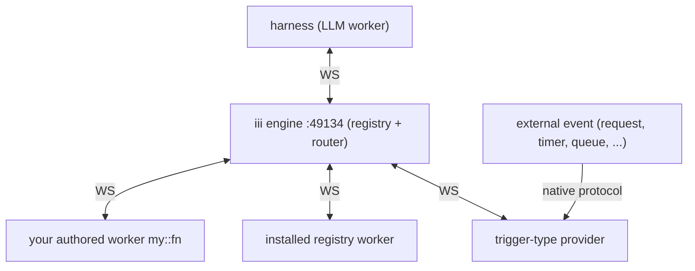

# iii

iii is a WebSocket-routed worker mesh. One engine process (default port `49134`) holds a live registry of every connected worker, every function those workers expose, and every trigger bound to them. Workers are independent OS processes that open a WebSocket to the engine and register **Functions** (`service::name` handlers) and **Triggers** (the events that invoke those Functions). There is no direct worker-to-worker traffic — every call routes through the engine, which makes the language, runtime, and physical location of any worker invisible to its callers.

**You extend yourself by writing iii workers.** A few lines get you on the bus:

```ts
import { registerWorker } from 'iii-sdk'

const iii = registerWorker(process.env.III_ENGINE_URL!, { workerName: 'demo' })

iii.registerFunction('demo::add', async (payload: { a: number; b: number }) => {
  return { c: payload.a + payload.b }
})
```

The instant the handshake completes, `demo::add` is callable from any worker (and the harness itself) via `iii.trigger({ function_id: 'demo::add', payload: { a: 2, b: 3 } })`. No restart, no registration with the harness — the engine routes it automatically.

## The four primitives

| Primitive | What it is | Owned by |
|---|---|---|
| Engine | One coordinator process. Routes every invocation. | The operator |
| Worker | A process that opens a WebSocket to the engine. | Anyone who writes one |
| Function | A named handler inside a worker, id `service::name`. Stable across worker restarts. | The registering worker |
| Trigger | A `(type, config, function_id)` triple. Causes a function to run when an event fires. | A worker (the type-publisher) + a caller (the binding) |

Three consequences worth internalising:

1. **No worker-to-worker traffic.** Every call is `worker → engine → worker`. Workers never address each other directly. Location and language are invisible.
2. **No restart coordination.** Restarting a worker is invisible to callers as long as it re-registers the same function ids. Two workers registering the same function id = automatic load-balance.
3. **No polling unless you opt in.** Triggers are the engine's push channel. The engine fans events out to bound functions when the underlying source fires.

The function id is the only contract between any two workers.



Every edge to the engine is a WebSocket. A trigger-type provider terminates some native protocol — an inbound request, a timer, a queue message — and translates it into engine traffic.

## Need a capability? Discover before you build — in this order

The most common harness mistake is reimplementing something that already exists, or hardwiring one worker out of habit. Work the steps in order; stop at the first that satisfies the need.

**1. Look at what is already registered in the engine.** The capability may be one call away.

```jsonc
// engine::functions::list   — every function on this engine, across all workers.
//   Filter with { prefix: 'svc::' } or { search: 'resize' }.
// engine::workers::list      — every connected worker.
```

If a registered function fits, just call it: `iii.trigger({ function_id, payload })`.

**2. Search the public registry.** If nothing registered fits, look for a worker to install. This goes through the `iii-directory` worker:

```jsonc
// directory::registry::workers::list { search: 'image resize' }
//   → published workers matching the query.
// directory::registry::workers::info { name: '<worker>' }
//   → that worker's README, config keys, API reference, and skills.
```

When one fits, install it: `worker::add { source: { kind: 'registry', name: '<worker>' }, wait: true }`.

`iii-directory` is itself a registry worker, so confirm it is connected before calling `directory::*`:

```jsonc
// engine::functions::list { prefix: 'directory::' }
//   → empty? install it first:
// worker::add { source: { kind: 'registry', name: 'iii-directory' }, wait: true }
```

**3. Build a worker.** Only when steps 1 and 2 both come up empty. Author it with the SDK (below), then deploy it. Discover the deployment/runtime surface the same way as any other capability — `directory::registry::workers::list` / `::info` and its skill — rather than assuming a worker name. (`worker::add { kind: 'local', path }` works over the bus, but `path` resolves on the **engine/daemon host**, not on the caller — so it only helps when your code already lives on that host. For un-published code that lives elsewhere, run it via a runtime/sandbox worker.)

> Discover in order. Don't jump to a worker you remember; the registry may hold a better fit, and the right surface is whatever the live engine and registry report — not training-data recall.

## The TypeScript SDK in brief

```ts
import {
  registerWorker, // factory; opens the WS from your code's perspective synchronously
  TriggerAction, // .Void() | .Enqueue({ queue })
  InvocationError, // typed error thrown by iii.trigger()
} from 'iii-sdk'
import { Logger } from '@iii-dev/helpers/observability' // OTel-aware structured logger; falls back to console.*

const iii = registerWorker(process.env.III_ENGINE_URL!, {
  workerName: 'my-worker', // appears in engine::workers::list
  invocationTimeoutMs: 30_000,
  reconnectionConfig: { maxRetries: -1 }, // -1 = infinite (the default)
})

// Publish a function. Same handler shape regardless of how the invocation arrives.
const ref = iii.registerFunction('svc::do-thing', async (payload) => ({ ok: true }), {
  description, // JSON-Schema-shaped metadata
  request_format,
  response_format,
})
ref.id // 'svc::do-thing'
ref.unregister() // drop just this function, keep the WS open

// Invoke. Three modes — same method, different `action`.
await iii.trigger({ function_id, payload, timeoutMs })
await iii.trigger({ function_id, payload, action: TriggerAction.Void() })
await iii.trigger({ function_id, payload, action: TriggerAction.Enqueue({ queue }) })

// Bind a function to an event.
iii.registerTrigger({ type, function_id, config })

// Publish a new event source other workers can bind to.
iii.registerTriggerType({ id, description }, { registerTrigger, unregisterTrigger })

await iii.shutdown() // graceful close; engine evicts this worker's functions immediately
```

`registerWorker(url, options?)` opens the WebSocket synchronously from your code's perspective — there is no separate `await connect()`. The handle queues calls until the handshake lands.

Schemas in `registerFunction` (`description`, `request_format`, `response_format`) are JSON-Schema-shaped **metadata** — the engine does not validate payloads against them today. Declare them anyway: they surface in `engine::functions::info`, document the contract for the next caller, and reserve a slot for future runtime validation.

### The three invocation modes

| `action` | Caller blocks? | Retries? | Returns | Use when |
|---|---|---|---|---|
| (omitted) | yes | no | the function's result | you need the value to continue |
| `TriggerAction.Void()` | no | no | `null` | one-way notification, no result needed |
| `TriggerAction.Enqueue({ queue })` | no | yes | `{ messageReceiptId }` | slow/unreliable work; the queue handles retry + back-pressure |

### Errors

- **Throw inside the handler** → propagates to the caller as `InvocationError` (carries `code`, `function_id`, `stacktrace`). Use for unexpected failures a retry might fix.
- **Return a structured value** (`{ ok: false, reason }`) → the call succeeds; the caller branches on the shape. Use for expected failures (validation, not-found, business rules).

Rule of thumb: if a retry might succeed, throw; if it will fail the same way, return a value.

### Lifecycle

- `iii.shutdown()` flushes pending traffic and closes the WS; the engine evicts the worker's functions immediately and resolves in-flight calls to it as `invocation_stopped`.
- `ref.unregister()` removes one registration (`FunctionRef`, `Trigger`, or `TriggerTypeRef`) without touching the others.
- The SDK reconnects automatically with backoff and **replays registrations verbatim** — never re-register manually. Callers see `invocation_stopped` during the disconnect window; treat it as cancellation, not transient failure.

## Triggers — discover the type, don't hardcode it

A trigger's `type` is a literal string published by some worker, and its `config` shape is defined by that worker. There is no fixed catalogue — discover what is available rather than assuming:

```jsonc
// engine::triggers::list             → every trigger TYPE currently published (legal `type:` values).
// engine::triggers::info { id }       → that type's config + return JSON Schema, and its provider.
// directory::registry::workers::info  → the provider's README, when you need prose + examples.
```

Then bind, passing the literal type string and the `config` its schema requires:

```ts
iii.registerTrigger({
  type: '<type from the list above>',
  function_id: 'svc::handler',
  config: {
    /* keys per the type's schema */
  },
})
```

Two cautions that apply to every trigger type:

- `registerTrigger` succeeds at the engine even when the `type` provider is **not connected** or the `config` keys are wrong — the binding lands but never fires. Confirm the provider is up (`engine::triggers::list` shows the type) and copy `config` keys from the type's schema, not from memory.
- The bound function receives whatever payload **that trigger type** delivers (its request schema in `engine::triggers::info`) and must return whatever shape that type expects. The handler contract is the trigger type's, not a generic one — check the schema before writing the handler.

### Custom trigger types — the deepest leverage

`registerTriggerType` turns your worker's native event source (a webhook hit, a file change, a row update) into something the whole bus can react to without polling. Keep a `{ trigger_id → { function_id, config } }` table in memory and walk it when the source fires:

```ts
type FsWatchConfig = { path: string; recursive?: boolean }
const bindings = new Map<string, { function_id: string; config: FsWatchConfig }>()

iii.registerTriggerType<FsWatchConfig>(
  { id: 'fs::watch', description: 'Fires when a file under `path` changes.' },
  {
    async registerTrigger({ id, function_id, config }) {
      bindings.set(id, { function_id, config })
      startWatching(id, config)
    },
    async unregisterTrigger({ id }) {
      stopWatching(id)
      bindings.delete(id)
    },
  },
)

function onChange(triggerId: string, path: string) {
  const binding = bindings.get(triggerId)
  if (!binding) return
  iii.trigger({ function_id: binding.function_id, payload: { path }, action: TriggerAction.Void() })
}
```

From the caller's side, your custom type is indistinguishable from any built-in one.

## Worker lifecycle — `worker::*` ops

Install, run, and remove workers. Each op is also `iii worker <cmd>` on the CLI. Fetch exact request/response shapes from the engine rather than trusting this list:

```jsonc
// engine::functions::info { function_id: 'worker::add' }   → request/response JSON Schema,
//                            plus metadata { default_timeout_ms, idempotent }
// worker::schema { function_id: 'worker::add' }            → same data, batched for all worker::* ops
// On a malformed payload the W105 error envelope's details.hint points back at worker::schema.
```

| Op | Does |
|---|---|
| `worker::add` | Install from registry or OCI; writes `iii.config.yaml`, caches under `~/.iii/managed/{name}/`, pins `iii.lock`. |
| `worker::remove` | Drop the config entry (keeps the cache). Requires `yes: true`. |
| `worker::update` | Re-pin registry workers to latest semver (OCI skipped). |
| `worker::start` | Spawn a configured worker. `wait: true` (default) blocks until the WS handshake. |
| `worker::stop` | Graceful shutdown. Requires `yes: true`. |
| `worker::list` | Installed + running state, including daemon-managed builtins. |
| `worker::clear` | Delete cached artifacts (keeps config). Requires `yes: true`. |
| `worker::schema` | JSON Schemas for every op. |

- **`worker::add` source variants:** `{ kind: 'registry', name, version? }`, `{ kind: 'oci', reference }`, and `{ kind: 'local', path }` — `path` is resolved on the **engine/daemon host** (works over the trigger as well as the CLI).
- **Consent:** `remove`, `stop`, and `clear` require exactly `yes: true` (the boolean, not `"true"`).
- Reach for `worker::list` before any other op when you don't already know what is installed.

## Discovery surface

| Call | Returns |
|---|---|
| `engine::functions::list` | Every function across all workers. Filter `prefix` / `search`. |
| `engine::functions::info { function_id }` | One function's schemas, description, owning worker. |
| `engine::workers::list` | Every WS-connected worker. |
| `engine::triggers::list` | Every trigger TYPE published (legal `type:` values). |
| `engine::triggers::info { id }` | One trigger type's config / return schema + provider. |
| `engine::registered-triggers::list` | Every trigger INSTANCE bound. Filter `function_id` / `worker`. |
| `worker::list` | Installed + running workers, including daemon-managed builtins. |
| `directory::registry::workers::list` | Workers published in the public registry. Filter `search`. |
| `directory::registry::workers::info { name }` | A registry worker's README, config, API reference, and skills. |
| `directory::skills::list` / `directory::skills::get { id }` | The markdown how-to a worker shipped — deeper than `engine::functions::info`. |

`engine::workers::list` only sees WS-connected workers; some daemon-managed providers serve traffic without opening an engine WS, so merge it with `worker::list` by `name` for the full picture.

## Trust runtime probes over introspection

`engine::*::list` reads can come back empty for blurred reasons: an older engine that lacks the surface, a store that lags live state, or genuinely nothing registered. **Disambiguate with a runtime probe** — call the function with `iii.trigger(...)`. If the probe succeeds, the registration is live regardless of what `*::list` reported. Don't unbind or re-register on the strength of an empty list alone; you'll churn a working worker.

## Anti-patterns

- **Polling instead of a trigger type.** A function on a timer reading a queue / file / table every N seconds is almost always wrappable as a custom trigger type. See [Custom trigger types](#custom-trigger-types--the-deepest-leverage).
- **Reinventing what exists.** Run the discovery steps (`engine::functions::list`, then `directory::registry::workers::list`) before authoring anything.
- **Hardwiring a remembered worker.** Pick the capability the live engine and registry surface, in order — not the one you reached for last time.
- **Side-channel state between workers.** Don't have workers read each other's files or hit each other's endpoints; route every cross-worker call through `iii.trigger`, and use a shared-state worker (discover one in the registry) for shared key/value.
- **Catching the wrong error type.** `iii.trigger()` throws `InvocationError`; catch that specifically or you lose `code` / `function_id` / `stacktrace`.
- **Trusting introspection over runtime probes.** An empty `*::list` can mean lag, not absence — a successful `iii.trigger()` is the authoritative signal.
