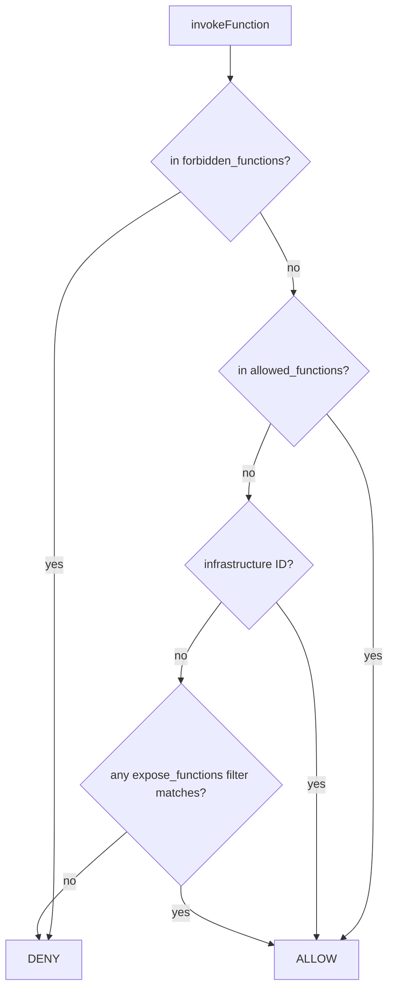

# iii-worker-manager

The `iii-worker-manager` is a mandatory engine worker that opens WebSocket listeners. The first entry in `iii-config.yaml` sets the main engine port (`49134` by default) for trusted internal traffic; additional entries open separate listeners with their own RBAC, middleware, and registration hooks. Channels are mounted on every listener at `/ws/channels/{channel_id}` — RBAC ports keep `engine::channels::create` always-allowed via the infrastructure carve-out so SDK `createChannel()` works without changes.

## When to Use

- Exposing the engine to an untrusted network — add a second `iii-worker-manager` entry with an `rbac` block and an `auth_function_id` instead of opening the main engine port.
- Restricting which functions a connected worker can invoke — combine `expose_functions` filters (operator-side) with `forbidden_functions` from `AuthResult` (per-session, hard deny).
- Auditing, rate-limiting, or enriching every invocation — set `middleware_function_id` on the listener; the middleware decides whether to call the target and what to return.
- Per-tenant or per-session namespace isolation — return `function_registration_prefix` from the auth function so every function/trigger this session registers is transparently prefixed without the worker code knowing.
- Gating dynamic registration — wire `on_function_registration_function_id`, `on_trigger_registration_function_id`, or `on_trigger_type_registration_function_id` to validate or rewrite registrations.

## Boundaries

- The infrastructure carve-out (`engine::channels::create`, `engine::workers::register`, `engine::log::*`, `engine::baggage::*`) is always allowed on RBAC listeners regardless of `expose_functions`. Adding one of those IDs to `forbidden_functions` denies it but logs a warning — workers may behave unpredictably (broken setup, lost logs, missing context).
- The first `iii-worker-manager` entry is the main engine port and should remain internal. Only RBAC-protected listeners belong on external networks.
- The middleware is **not** a pre-handler — it must invoke the target function itself (typically via `iii.trigger`) and return its result. Returning early without invoking simply skips the call.
- `forbidden_functions` from the auth result wins over both `allowed_functions` and `expose_functions`. There is no way for a session to override an operator's deny list.
- Registration hooks return mapped fields or **throw** to deny. Omitted result fields keep their original values; returning `{}` is a no-op (allow as-is).
- Triggers and functions registered through an RBAC session are scoped to that session and cleaned up automatically on disconnect.

## Configuration

Two listeners — one internal, one external with RBAC:

```yaml
workers:
  - name: iii-worker-manager
    config:
      port: 49134

  - name: iii-worker-manager
    config:
      host: 0.0.0.0
      port: 49135
      middleware_function_id: my-project::middleware
      rbac:
        auth_function_id: my-project::auth
        on_function_registration_function_id: my-project::on-fn-reg
        on_trigger_registration_function_id: my-project::on-trig-reg
        on_trigger_type_registration_function_id: my-project::on-trig-type-reg
        expose_functions:
          - match("api::*")
          - match("*::public")
          - metadata:
              public: true
```

## Auth function

Receives `AuthInput { headers, query_params, ip_address }`, returns `AuthResult`. Throw to reject the connection.

```typescript
import type { AuthInput, AuthResult } from '@iii-dev/helpers/worker-connection-manager'

iii.registerFunction(
  'my-project::auth',
  async (input: AuthInput): Promise<AuthResult> => {
    const token = input.headers?.['authorization']?.replace(/^Bearer\s+/i, '')
    if (!token) throw new Error('Missing credentials')

    const user = await validateToken(token)

    return {
      allowed_functions: [],
      forbidden_functions: user.role === 'readonly'
        ? ['api::users::delete', 'api::users::update']
        : [],
      allowed_trigger_types: user.role === 'admin' ? ['cron', 'webhook'] : undefined,
      allow_trigger_type_registration: user.role === 'admin',
      function_registration_prefix: `tenant-${user.tenant_id}`,
      context: { user_id: user.id, role: user.role, tenant_id: user.tenant_id },
    }
  },
)
```

`AuthResult` defaults: `allow_function_registration: true`, `allow_trigger_type_registration: false`, `allowed_trigger_types: undefined` (permissive — every type allowed). Setting `function_registration_prefix` makes the engine transparently rewrite IDs in both directions; the worker SDK never sees the prefix.

## Middleware function

Runs on every invocation through this listener. Receives `MiddlewareFunctionInput { function_id, payload, action, context }`. Must call the target function itself.

```typescript
import type { MiddlewareFunctionInput } from 'iii-sdk'

iii.registerFunction(
  'my-project::middleware',
  async (input: MiddlewareFunctionInput) => {
    console.log(`[audit] user=${input.context.user_id} → ${input.function_id}`)

    return iii.trigger({
      function_id: input.function_id,
      payload: {
        ...input.payload,
        _caller_id: input.context.user_id,
        _caller_role: input.context.role,
      },
    })
  },
)
```

Skipping the `iii.trigger` call short-circuits the request — useful for rate-limit rejections (return a structured error envelope instead of invoking the target).

## Registration hooks

Each hook receives the registration details plus `AuthResult.context`. Return mapped fields or throw to deny. Omitted fields keep their original value.

```typescript
import type {
  OnFunctionRegistrationInput,
  OnTriggerRegistrationInput,
  OnTriggerTypeRegistrationInput,
} from '@iii-dev/helpers/worker-connection-manager'

iii.registerFunction(
  'my-project::on-fn-reg',
  async (input: OnFunctionRegistrationInput) => {
    if (input.function_id.startsWith('internal::')) {
      throw new Error('Cannot register internal functions')
    }
    return { function_id: input.function_id }
  },
)

iii.registerFunction(
  'my-project::on-trig-reg',
  async (input: OnTriggerRegistrationInput) => {
    const role = input.context.role as string
    if (!input.function_id.startsWith(`${role}::`)) {
      throw new Error('Function ID must be prefixed with the role')
    }
    return { function_id: `${role}::${input.function_id}` }
  },
)

iii.registerFunction(
  'my-project::on-trig-type-reg',
  async (input: OnTriggerTypeRegistrationInput) => {
    if (input.context.role !== 'admin') {
      throw new Error('Only admins can register trigger types')
    }
    return {}
  },
)
```

A worker can register a trigger type only when `allow_trigger_type_registration: true` AND (if configured) the hook returns a result. A worker can register a trigger only when its `trigger_type` is in `allowed_trigger_types` (or the field is omitted) AND the hook returns a result.

## Function filters

`expose_functions` accepts wildcard and metadata filters; multiple filters are OR'd. Metadata filters AND across keys.

```yaml
expose_functions:
  - match("api::*")             # ID glob: * matches any chars
  - match("*::public")          # suffix match
  - match("api::*::read")       # multi-segment match
  - metadata:                   # all keys must match
      public: true
      tier: free
  - metadata:
      name: match("*public*")   # metadata values can be wildcards too
```

A function is exposed if **any** filter matches. Empty `expose_functions` = no functions exposed (other than the infrastructure carve-out).

## Channels on RBAC ports

Channels are mounted at `/ws/channels/{channel_id}` on the same port the worker connected through. `engine::channels::create` is always allowed (infrastructure carve-out), so RBAC listeners can hand out channel refs even with empty `expose_functions`. SDK `createChannel()` works unmodified — channel data flows through whichever listener the worker is on, never the main engine port. Access to a channel WebSocket is independently validated by the `access_key` capability token in the `StreamChannelRef`.

## Access decision flow



Rule of thumb: deny by default (rule 5). Operators allow via `expose_functions`; auth functions augment with `allowed_functions` and tighten with `forbidden_functions`. The infrastructure carve-out is the only path that ignores `expose_functions` entirely.

## Security notes

- Always set `auth_function_id` on listeners that face untrusted networks. A listener with no `rbac` block authenticates nothing — every connection is allowed and `expose_functions` alone gates access.
- Prefer narrow `expose_functions` over `match("*")`. Audit the list whenever a new namespace lands in the engine.
- The middleware is the right place for request validation, rate limiting, and audit logging. Keep it idempotent — invocations may be retried.
- Use `function_registration_prefix` for multi-tenant isolation rather than asking each tenant to register pre-prefixed function IDs. The prefix is invisible to the worker SDK.
